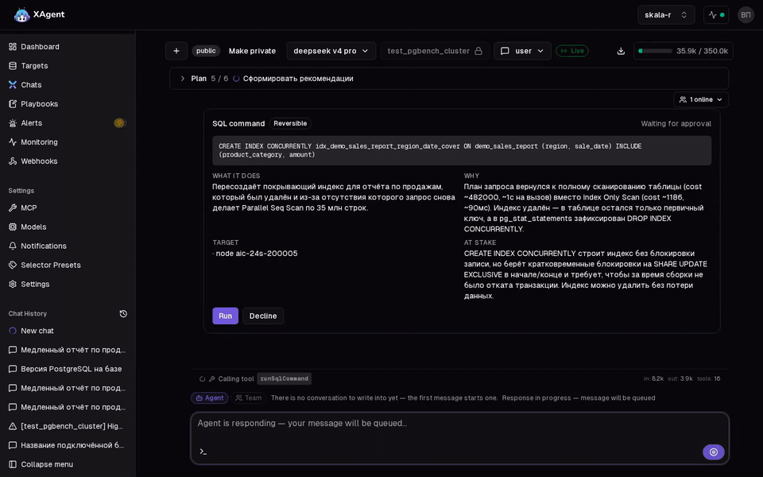
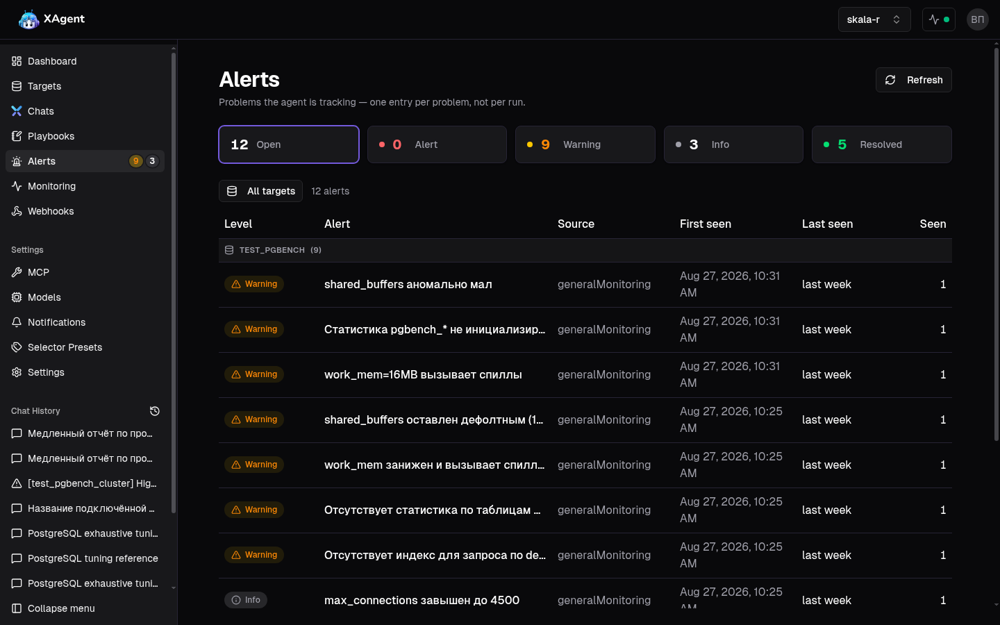

<div align="center">
  <picture>
    <source media="(prefers-color-scheme: dark)" srcset="brand-kit/banner/xagent-banner-github-dark-mode@2x.png">
    <source media="(prefers-color-scheme: light)" srcset="brand-kit/banner/xagent-banner-github-light-mode@2x.png">
    
  </picture>
</div>

[English](./README.md) | **Русский**

# XAgent, ваш ИИ-эксперт по PostgreSQL

XAgent — ИИ-агент, который следит за вашими базами PostgreSQL: читает логи и метрики, находит, что идёт
не так, предлагает изменения настроек, по запросу расследует инциденты и сообщает, когда что-то требует
внимания. Это как опытный DBA в команде, доступный круглосуточно.

В этом репозитории лежат инсталлятор, архивы выпусков и документация. Исходный код хранится отдельно.

XAgent бесплатен, в том числе для прода: см. [Лицензия](#лицензия).

## Две минуты XAgent

Отчёт по продажам стал медленным. Агент находит удалённый индекс, предлагает одну команду, человек её
разрешает, и отчёт снова быстрый. Демо с озвучкой, две минуты:

https://github.com/user-attachments/assets/6355f8bd-55fa-45a2-a001-63b56efe71c4

То же самое без звука, коротко:



**Что умеет:**

- Мониторинг по расписанию: плейбук выполняется против базы, а найденное становится записью об
  инциденте — открывается один раз, подтверждается, пока проблема длится, закрывается с указанием причины
- Чат с агентом о конкретной базе; ответ формируется на сервере и сохраняется, даже если страница закрыта
  или соединение оборвалось
- Анализ логов и метрик (VictoriaLogs, VictoriaMetrics) через суб-агентов, которые расследуют
  самостоятельно
- Расследование по алерту из системы мониторинга (AlertManager, Prometheus)
- 17 встроенных диагностических плейбуков плюс плейбуки, которые вы пишете сами
- Команды на сервере с подтверждением человека: агент предлагает, показывает риск, человек нажимает
  кнопку. Функция выключена по умолчанию и включается для каждой базы отдельно
- Официальная документация PostgreSQL 14–18 внутри установки: поиск и цитирование без выхода в интернет
- Кластеры: Patroni или кластер на другом ПО репликации — роли узлов, отставание реплик, настройки,
  различающиеся между узлами
- Поддержка нескольких LLM: облачный API вроде DeepSeek, любой OpenAI-совместимый сервер, LiteLLM или
  локальная модель через Ollama или vLLM
- Командный доступ: четыре встроенные роли, выдача доступа к отдельным базам, приватные чаты по вашему
  выбору и журнал активности проекта
- Уведомления в Slack при открытии и закрытии записи об инциденте
- Установка в своём контуре, в том числе в закрытой сети без доступа в интернет
- Экспериментальный SQL-режим: запросы к вашим данным на естественном языке
- Расширяемость через MCP-серверы

Агент ничего не меняет сам: он анализирует и предлагает, а решает человек. В
[кратком руководстве](./docs/ru/quick-start.md) перечислено, что агент делает и где его границы.

## Чем XAgent отличается от xataio/agent

XAgent начался как форк [xataio/agent](https://github.com/xataio/agent) и сохранил его форму: агент,
который читает логи и метрики и разговаривает об одной базе за раз. Добавлено то, что нужно команде с
установкой в собственном контуре, чтобы пользоваться этим всерьёз:

- **Работает внутри вашего периметра.** Локальная модель через Ollama или vLLM либо любой
  OpenAI-совместимый сервер; офлайн-архив инсталлятора для сети без интернета; никакой телеметрии.
- **Команды с подтверждением человека.** Агент предлагает одну команду, показывает риск, а человек
  разрешает или отклоняет её прямо в чате. Выключено по умолчанию, включается для каждой базы.
- **Записи об инцидентах вместо потока сообщений.** Проблема открывается один раз, подтверждается, пока
  длится, и закрывается с причиной; Slack получает три сообщения за всю её историю.
- **Кластеры.** Patroni и другие схемы репликации: роли узлов, отставание реплик, различающиеся
  настройки, любой узел как точка переключения.
- **Командный доступ.** Четыре роли, доступ к отдельным базам, приватные чаты, журнал активности проекта.
- **Расследования из вашего мониторинга.** AlertManager или Prometheus присылает сигнал, агент
  расследует его в очереди, которая переживает перезапуск, а дребезжащая проблема получает одно
  расследование.
- **Встроенная документация PostgreSQL 14–18**, поиск и цитирование без выхода из сети.



## Пилоты и партнёрства

XAgent ищет команды, готовые запустить его на реальных базах и рассказать, что ломается. Чтобы обсудить
пилот, интеграцию с вашим PostgreSQL-продуктом или что-то ещё: откройте issue в этом репозитории или
напишите на адрес из профиля автора на GitHub.

## Установка

```sh
curl -fsSL https://raw.githubusercontent.com/vbp1/pgxagent/main/install.sh | bash
```

Скрипт скачивает свежий выпуск, сверяет его с опубликованной контрольной суммой, распаковывает и печатает
команду для следующего шага. На этом он останавливается намеренно: инсталлятор задаёт вопросы (порт,
учётные данные базы, какого провайдера моделей использовать), и ему нужен терминал.

Дальше:

```sh
cd xagent-<version>
./xagent-installer verify
sudo ./xagent-installer install --path /opt/xagent --up
```

## Какой архив

Каждый выпуск содержит два архива одной версии. Они отличаются только тем, включены ли образы контейнеров.

| Архив                                      | Размер  | Для чего                                                    |
| ------------------------------------------ | ------- | ----------------------------------------------------------- |
| `xagent-<version>-linux-amd64-online.zip`  | ~35 МБ  | Сервер с интернетом — образы скачиваются во время установки |
| `xagent-<version>-linux-amd64-offline.zip` | ~320 МБ | Закрытая сеть — все образы лежат внутри архива              |

Чтобы взять офлайн-архив: `curl -fsSL .../install.sh | bash -s -- --offline`.

Для скачивания не нужна учётная запись: образы лежат в публичном репозитории и забираются анонимно.

## Проверка скачанного

Рядом с архивами каждый выпуск публикует `SHA256SUMS-<version>.txt`, потому что список контрольных сумм,
упакованный внутрь описываемого им архива, за этот архив поручиться не может. В нём обе строки, проверьте
ту, что относится к вашему архиву:

```sh
grep xagent-<version>-linux-amd64-online.zip SHA256SUMS-<version>.txt | sha256sum -c
```

Команда инсталлятора `verify` — другая проверка: она подтверждает, что файлы внутри архива совпадают с
приложенным манифестом.

## Документация

Руководства лежат в [`docs/`](./docs): на русском ([`docs/ru`](./docs/ru)) и на английском
([`docs/en`](./docs/en)).

| Руководство                                                             | О чём                                                        |
| ----------------------------------------------------------------------- | ------------------------------------------------------------ |
| [Быстрый старт](./docs/ru/quick-start.md)                               | Первый запуск: подключить базу, задать первый вопрос         |
| [Установка](./docs/ru/install-guide.md)                                 | Требования, оба архива, установка, обновление, коды возврата |
| [Цели](./docs/ru/targets.md)                                            | Добавление баз, за которыми следит XAgent                    |
| [Роли и доступ](./docs/ru/rbac.md)                                      | Роли, доступ к базам, видимость чатов и выдача инструментов  |
| [Вебхуки](./docs/ru/webhooks.md)                                        | Приём алертов из внешней системы                             |
| [Пример плейбука](./docs/ru/example-playbook-proactive-health-check.md) | Разобранный плейбук как образец для копирования              |
| [Что нового](./docs/ru/changelog.md)                                    | Что изменилось в этом выпуске                                |
| [Известные проблемы](./docs/ru/known-issues.md)                         | Известные проблемы выпуска и обходные пути                   |

## Что нужно

|                | Минимум | Рекомендуется    |
| -------------- | ------- | ---------------- |
| ОС             | Linux   | Ubuntu 22.04 LTS |
| Docker Engine  | 20.10+  | 24.0+            |
| Docker Compose | v2.0+   | v2.20+           |
| Память         | 4 ГБ    | 8–16 ГБ          |
| Диск           | 15 ГБ   | 30+ ГБ           |

XAgent также нужна модель, которой он думает: облачный API вроде DeepSeek или что угодно
OpenAI-совместимое, что вы запускаете сами, в том числе локально. В
[руководстве по установке](./docs/ru/install-guide.md) перечислены провайдеры, которые мы проверяли.

XAgent не устанавливает Docker. Если Docker на машине нет, сначала поставьте его так, как рекомендует
ваш дистрибутив.

## Выпуски

Каждая версия публикуется на [странице выпусков](https://github.com/vbp1/pgxagent/releases) с обоими
архивами и их контрольными суммами.

## Лицензия

XAgent бесплатен, в том числе для прода и коммерческого использования, на любом числе серверов и баз.
Нельзя перепродавать его, передавать третьим лицам и предоставлять как хостинг-сервис. Полные условия в
[LICENSE.md](./LICENSE.md).

XAgent — форк [xataio/agent](https://github.com/xataio/agent), ныне заархивированного. Код,
унаследованный от исходного проекта, остаётся под Apache License 2.0; см.
[LICENSE-APACHE-2.0](./LICENSE-APACHE-2.0).
